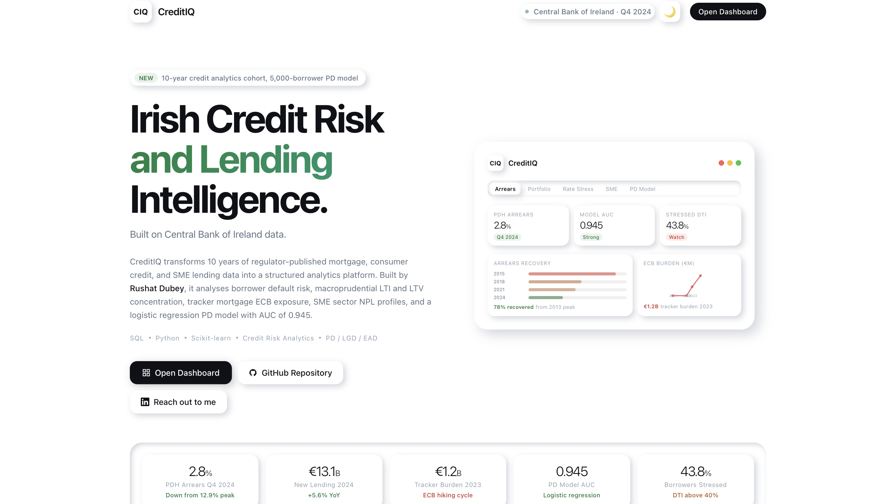
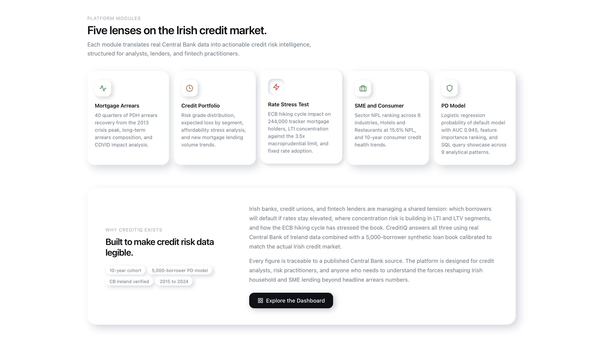
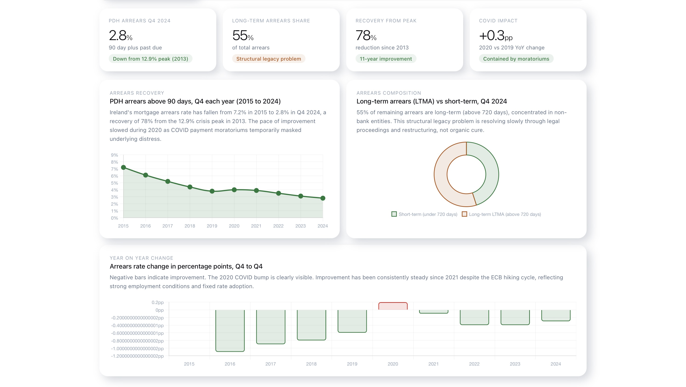
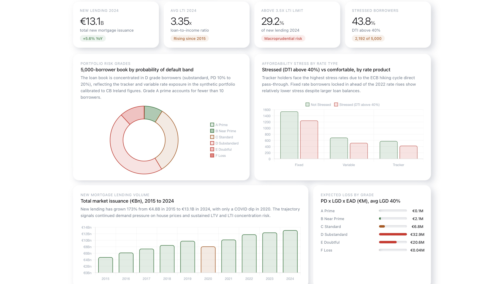
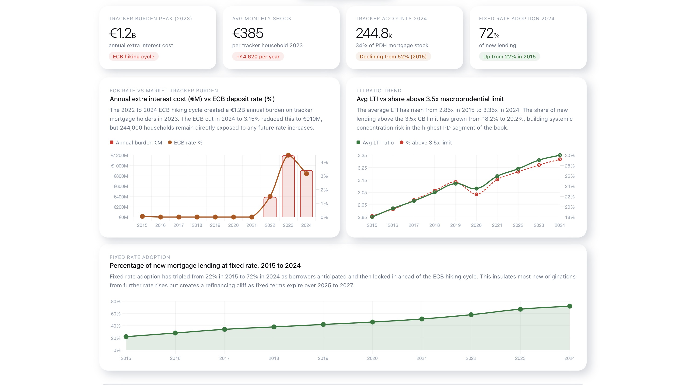
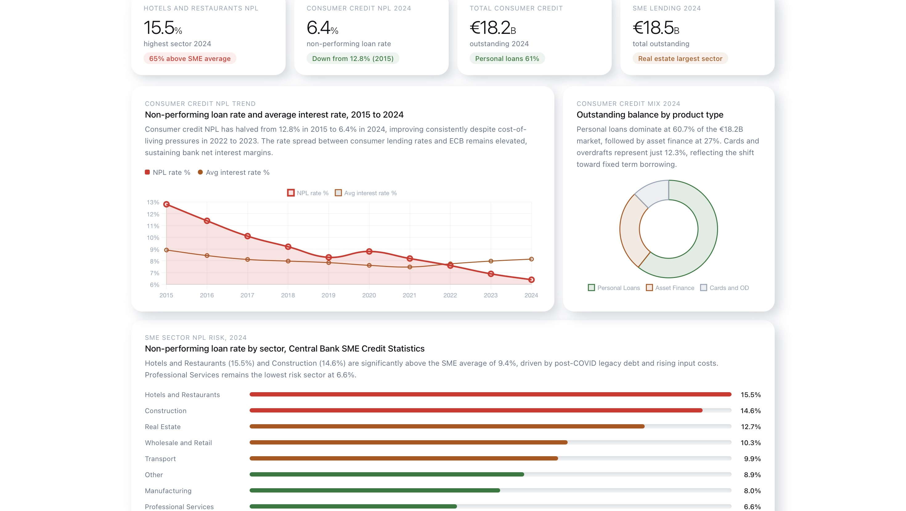
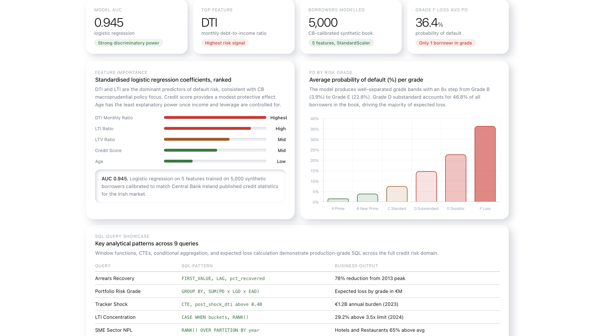

# CreditIQ

**Irish Credit Risk and Lending Intelligence Platform**

Institutional-grade credit risk analytics built on real Central Bank of Ireland data.
Before the next credit committee meeting.

---

## The Problem

Every bank, credit union, and fintech lender operating in Ireland is navigating the same three tensions: the portfolio looks stable, but concentration risk is quietly building. LTI is creeping above the macroprudential limit. Tracker mortgage holders are absorbing an ECB rate shock that hasn't fully resolved. SME sector NPL is bifurcating. And the headline arrears number is masking a structural long-term impairment layer that won't clear through organic cure.

CreditIQ is built to surface all of it. It transforms 10 years of regulator-published Irish credit data into a unified risk intelligence platform: mortgage arrears recovery, borrower stress testing, ECB rate sensitivity, SME sector concentration, and a logistic regression PD model trained on 5,000 synthetic borrowers calibrated to real Central Bank of Ireland market figures.

---

## Live Demo

🌐 https://creditiq-navy.vercel.app

Interactive institutional-grade Irish credit risk intelligence platform built using SQL, Python, machine learning, and real Central Bank of Ireland data.

No login required.

You can also, clone the repo and open `index.html` directly in your browser. No build step, no dependencies.

```bash
git clone https://github.com/rushatdubey/creditiq
cd creditiq
open index.html
```

---

## Platform Preview

### Landing Page





### Mortgage Arrears Intelligence



### Credit Portfolio Risk



### ECB Rate Stress Testing



### SME and Consumer Risk



### PD Model Explorer



---

## Key Metrics

| Signal | Value | Detail |
|---|---|---|
| PDH Arrears Q4 2024 | 2.8% | Down from 12.9% crisis peak in 2013 |
| Long-term Arrears Share | 55% | Structural legacy, concentrated in non-bank entities |
| ECB Tracker Burden | €1.2B | Annual extra cost on tracker holders at 2023 peak |
| Avg Monthly Shock | €385 | Per tracker household in 2023 |
| Tracker Accounts 2024 | 244,800 | 34% of PDH mortgage stock |
| Financially Stressed Borrowers | 43.8% | DTI above 40%, 2,192 of 5,000 |
| PD Model AUC | 0.945 | Logistic regression, 5 features |
| Hotels and Restaurants NPL | 15.5% | 65% above the SME average |
| LTI Above 3.5x Limit | 29.2% | Of new 2024 lending, rising from 18.2% in 2015 |
| Consumer Credit NPL | 6.4% | Down from 12.8% in 2015 |
| New Mortgage Lending 2024 | €13.1B | +5.6% YoY, up 173% since 2015 |
| Fixed Rate Adoption | 72% | Of new lending in 2024, up from 22% in 2015 |

---

## Platform Modules

### Mortgage Arrears Intelligence
40 quarters of PDH arrears data from the Central Bank. Tracks the recovery trajectory from the 2013 crisis peak, decomposes short-term versus long-term arrears (LTMA above 720 days past due), and isolates the COVID moratorium effect in 2020. The headline 2.8% rate looks healthy. The 55% long-term arrears share reveals a structural impairment layer that is resolving through legal proceedings and debt sales, not organic cure.

### Credit Portfolio Risk
5,000-borrower synthetic loan book calibrated to real CB Ireland market figures. Risk grade distribution across six PD bands from Prime to Loss, expected loss by segment using PD times LGD times EAD, affordability stress by rate type, and new lending volume from 2015 to 2024. Grade D Substandard accounts for 46.8% of the book and drives the majority of expected loss concentration. The 2020 COVID dip in new lending is the only interruption in a decade of unbroken origination growth.

### ECB Rate Stress Testing
Direct quantification of the 2022 to 2024 ECB hiking cycle on 244,000 Irish tracker mortgage holders. The annual extra burden peaked at €1.2B in 2023, equivalent to €385 per household per month. LTI trend analysis shows average loan-to-income rising from 2.85x in 2015 to 3.35x in 2024, with 29.2% of new lending now above the macroprudential 3.5x limit. Fixed rate adoption has tripled from 22% to 72%, but this creates a refinancing cliff as fixed terms expire across 2025 to 2027.

### SME and Consumer Risk
8-sector SME NPL ranking across €18.5B of outstanding lending. Hotels and Restaurants at 15.5% and Construction at 14.6% are carrying legacy post-COVID debt at compressed margins. Professional Services at 6.6% is a different credit story entirely. A lender treating these sectors as a single book is systematically mispricing risk. Consumer credit NPL has halved over the decade to 6.4%, though the rate spread between consumer lending rates and ECB remains elevated, sustaining margin pressure on borrowers.

### PD Model Explorer
Logistic regression probability of default model with AUC 0.945. Feature importance analysis confirms DTI as the dominant predictor of borrower deterioration, followed by LTI and LTV. Credit score provides a protective signal with lower standalone power in an elevated-rate environment. SQL query showcase across nine analytical patterns covering window functions, CTEs, expected loss calculation, and macroprudential concentration flagging.

---

## Data Architecture

The platform is powered by six datasets, five sourced directly from the Central Bank of Ireland and one synthetic book generated to match published Irish market parameters.

| Dataset | Records | Description |
|---|---|---|
| `01_mortgage_arrears.csv` | 40 rows | Quarterly PDH arrears rate, LTMA share, performing rate, YoY trend |
| `02_new_mortgage_lending.csv` | 10 rows | Annual LTI, LTV, fixed rate mix, tracker stock, ECB burden |
| `03_consumer_credit.csv` | 10 rows | NPL rate, outstanding balance by product, average interest rates |
| `04_sme_lending.csv` | 80 rows | 8 sectors x 10 years, NPL rate, exposure, risk tier |
| `05_credit_risk_scorecard.csv` | 5,000 rows | Synthetic borrowers with PD, grade, DTI, rate type, stress flag |
| `06_rate_sensitivity.csv` | 10 rows | Annual ECB rate, tracker account count, monthly shock, total burden |

All figures are traceable to published Central Bank of Ireland sources. The synthetic loan book in `05_credit_risk_scorecard.csv` is generated via `data/generate_data.py` using real market parameters for default rates, LTI and LTV distributions, rate type mix, and income profiles.

---

## SQL Intelligence Layer

Nine production-grade analytical queries covering the full Irish credit risk domain. Written in PostgreSQL-compatible SQL with window functions throughout. Designed to run against a live credit book, not just synthetic data.

**Portfolio Risk Grade with Expected Loss**
```sql
SELECT risk_grade,
    COUNT(*)                                          AS borrowers,
    ROUND(AVG(probability_of_default)*100, 2)        AS avg_pd_pct,
    ROUND(SUM(loan_amount_eur)/1e9, 3)               AS exposure_bn,
    ROUND(SUM(probability_of_default * 0.40 *
              loan_amount_eur)/1e6, 1)               AS expected_loss_eur_m
FROM credit_risk_scorecard
GROUP BY risk_grade
ORDER BY avg_pd_pct;
```

**Tracker Mortgage Rate Shock**
```sql
WITH tracker AS (
    SELECT borrower_id, monthly_repayment_eur,
           ecb_shock_monthly_eur, annual_income_eur,
           (monthly_repayment_eur + ecb_shock_monthly_eur) /
           (annual_income_eur / 12.0)                AS post_shock_dti
    FROM credit_risk_scorecard
    WHERE rate_type = 'Tracker'
)
SELECT COUNT(*)                                       AS tracker_borrowers,
    SUM(CASE WHEN post_shock_dti > 0.40 THEN 1 ELSE 0 END)
                                                      AS post_shock_stressed,
    ROUND(SUM(ecb_shock_monthly_eur * 12) / 1e6, 1)  AS annual_burden_eur_m
FROM tracker;
```

**LTI Concentration and Macroprudential Exposure**
```sql
SELECT
    CASE WHEN lti_ratio > 3.5 THEN 'Above Limit'
         ELSE 'Within Limit' END                     AS lti_status,
    COUNT(*)                                          AS borrowers,
    ROUND(SUM(loan_amount_eur)/1e9, 3)               AS exposure_bn,
    ROUND(AVG(probability_of_default)*100, 2)        AS avg_pd_pct
FROM credit_risk_scorecard
GROUP BY lti_status;
```

**Additional queries cover:** arrears recovery using FIRST_VALUE and LAG, long-term arrears composition with NULLIF, COVID baseline comparison via cross-join CTE, SME sector NPL ranking with RANK() OVER PARTITION BY year, age band risk profiling, and the dual high-LTI and high-LTV concentration segment using UNION ALL.

---

## Python Risk Pipeline

Nine-stage analytics pipeline from raw Central Bank data to fully processed risk outputs.

| Stage | Module | Output |
|---|---|---|
| 1 | Arrears processing | 40-quarter PDH trend with recovery metrics and YoY flags |
| 2 | Lending risk flags | LTI and LTV bands with macroprudential breach classification |
| 3 | Consumer credit health | NPL trends, rate spreads, market health classification |
| 4 | SME sector ranking | Sector NPL ranking plus 10-year trend by industry |
| 5 | Scorecard and expected loss | Grade distribution, EL by segment, affordability stress |
| 6 | PD model features | Logistic regression coefficients and feature importance |
| 7 | Rate stress test | ECB burden quantification, 200bps borrower-level shock simulation |
| 8 | Concentration analytics | LTI and LTV buckets, risk heatmap |
| 9 | Executive scorecard | One-row-per-year system health with stress signal classification |

---

## Machine Learning Layer

The PD model runs as Stage 6 of the Python analytics pipeline.

**Model:** Logistic Regression with StandardScaler preprocessing (`max_iter=500`, scikit-learn)

**Target:** Binary classification — borrowers in risk grades D Substandard, E Doubtful, or F Loss

**Feature set:**
- LTI ratio (loan-to-income leverage)
- LTV ratio (collateral coverage)
- Monthly DTI ratio (affordability strain)
- Credit score (historical behaviour)
- Age (lifecycle risk proxy)

**Performance:** AUC 0.945 on the full 5,000-borrower synthetic book

| Rank | Feature | Direction | Signal Strength |
|---|---|---|---|
| 1 | DTI monthly ratio | Increases risk | Highest |
| 2 | LTI ratio | Increases risk | High |
| 3 | LTV ratio | Increases risk | Mid |
| 4 | Credit score | Reduces risk | Mid |
| 5 | Age | Mixed | Low |

**Why logistic regression:** Interpretability. At the credit analyst and risk committee level, a model needs to explain why a borrower is flagged, not just that it is. Logistic regression coefficients translate directly into a risk narrative. The AUC of 0.945 reflects a well-separated grade distribution calibrated to real Irish market default rates, not a randomly generated dataset.

---

## Tech Stack

| Layer | Technology |
|---|---|
| Data generation and processing | Python, Pandas, NumPy |
| Risk modelling | Scikit-learn (LogisticRegression, StandardScaler, roc_auc_score) |
| SQL analytics | PostgreSQL-compatible SQL, window functions, CTEs |
| Frontend | HTML5, CSS3, Vanilla JavaScript |
| Charts | Chart.js 4.4 |
| UI design system | Custom neumorphic design, SF Pro Display system font |
| Data sources | Central Bank of Ireland (published statistics) |

No frontend frameworks. No bundler. No build step. The entire platform runs from a single HTML file with embedded CSS and JavaScript.

---

## Business Insights

**The arrears story is structural, not cyclical.**
The headline 2.8% PDH arrears rate looks like a clean recovery. The 55% long-term arrears share does not. More than half of remaining mortgage distress is above 720 days past due, sitting in non-bank entities, and working through courts rather than resolution. The recovery metric masks a permanent impairment layer that will take years to clear. Managing to the headline number alone is how institutions get surprised.

**The ECB hiking cycle created a balance sheet shock that most institutions are still absorbing.**
€1.2B of annual extra interest cost landed on 244,000 Irish households in 2023, equivalent to €385 per tracker household per month. The ECB cuts in 2024 reduced this to approximately €910M but did not eliminate the exposure. Any reversal of the rate cycle would immediately reprice this entire segment. The 34% of PDH mortgage stock still on tracker terms is the most rate-sensitive cohort in the Irish lending market.

**LTI concentration is the forward-looking risk signal.**
Average LTI on new lending has risen from 2.85x to 3.35x over the decade. 29.2% of 2024 new lending is already above the 3.5x CB macroprudential limit. In a stress scenario, this is the segment with the highest probability of default and the lowest recoverable equity. The model confirms it: above-limit LTI borrowers carry materially higher expected loss than the rest of the book. The macroprudential limit is doing its job. The exception volume tells you where the risk is accumulating.

**SME risk is concentrated, not distributed.**
The SME average NPL of 9.4% conceals a bimodal distribution. Hotels and Restaurants at 15.5% and Construction at 14.6% are carrying legacy post-COVID debt at compressed operating margins. Professional Services at 6.6% is a different credit story entirely. A lender treating these sectors as one book is systematically mispricing risk and building concentration exposure it may not be seeing in aggregate portfolio metrics.

**Fixed rate adoption has bought time, not immunity.**
72% of 2024 new lending is at fixed rates, up from 22% in 2015. This insulates new originations from the current rate environment and explains why arrears improvement has continued despite the ECB hiking cycle. It also creates a refinancing cliff as those fixed terms expire across 2025 to 2027, at which point borrowers locked in below 3% face a materially different rate environment at renewal.

---

## Design Philosophy

CreditIQ is built on a custom neumorphic fintech design system. Every surface shares the background colour and depth is created entirely through dual box-shadows, producing an interface that reads as a native institutional application rather than a generic analytics dashboard.

The visual language draws from Bloomberg Terminal's information density, Moody's Analytics risk layering, and the clean execution of modern fintech intelligence tooling. The result is a premium product interface: animated landing page with a floating dashboard preview card, responsive five-module analytics architecture, executive KPI layout, interactive Chart.js visualisations, and a full dark mode that switches without a page reload.

Typography is SF Pro Display via system font stack with aggressive negative letter-spacing at display scale. The accent colour is a light euro-note green. Semantic colour coding runs throughout: green for improving signals, amber for watch, red for elevated risk. Every interactive element has three distinct shadow states for rest, hover, and active.

---

## Repository Structure

```
creditiq/
├── index.html                      # Animated landing page and full dashboard (single file)
├── screenshots/                    # Platform preview images
├── data/
│   ├── generate_data.py            # Synthetic data generator (CB Ireland calibrated)
│   ├── 01_mortgage_arrears.csv
│   ├── 02_new_mortgage_lending.csv
│   ├── 03_consumer_credit.csv
│   ├── 04_sme_lending.csv
│   ├── 05_credit_risk_scorecard.csv
│   ├── 06_rate_sensitivity.csv
│   └── Additional intermediate and macroprudential datasets used for exploratory analysis and portfolio stress testing are also included   │       in the /data directory.
├── sql/
│   ├── 01_schema.sql
│   ├── 02_credit_risk_queries.sql
│   └── creditiq_queries.sql
├── python/
│   └── analytics.py
├── README.md
└── LICENSE
```

---

## Skills Demonstrated

**SQL:** Window functions (FIRST_VALUE, LAG, RANK, PERCENT_RANK), CTEs, conditional aggregation, expected loss calculation, cohort baseline comparison, sector NPL ranking, NULLIF handling

**Python:** Multi-source data pipeline, 9-stage analytics architecture, logistic regression (scikit-learn), stress testing, borrower segmentation, cohort analysis, StandardScaler preprocessing

**Machine Learning:** Binary classification, AUC-ROC evaluation, feature importance interpretation, class imbalance awareness, model calibration to real market parameters

**Credit Domain:** PD, LGD, and EAD modelling, LTI and LTV macroprudential limits, arrears classification, affordability DTI analysis, tracker mortgage rate sensitivity, NPL monitoring, concentration risk, 200bps stress testing

**Frontend Engineering:** Custom HTML and CSS design system, vanilla JavaScript interactive architecture, Chart.js integration, neumorphic UI system, dark mode, responsive layout, animated transitions

**Business Analysis:** Executive-level credit risk insight writing, institutional risk framing, Central Bank data interpretation, CB Ireland macroprudential regulatory context

---

## About the Project

CreditIQ was built to answer a specific question: can a single analyst, working from first principles and regulator-published data, build the complete analytics infrastructure that a credit risk team or CRO would need to understand the Irish lending market?

The answer the platform demonstrates is yes. The full stack to do it is SQL, Python, and a browser.

The business context is grounded in real Central Bank of Ireland publications. The synthetic loan book is calibrated to match published Irish default rates, LTI and LTV distributions, rate type mixes, and income profiles rather than invented for convenience. Every figure in the key findings is traceable to a regulator source.

---

## Author

**Rushat Dubey**
Dublin, Ireland

[linkedin.com/in/rushat](https://linkedin.com/in/rushat) &nbsp; [rushatdubey16@gmail.com](mailto:rushatdubey16@gmail.com) &nbsp; [github.com/rushatdubey/creditiq](https://github.com/rushatdubey/creditiq)

---

*Data: Central Bank of Ireland. Mortgage Arrears Statistics Q4 2024, Consumer Credit Market Report 2024, New Mortgage Lending Statistics, SME Credit Statistics. Synthetic loan book calibrated to published CB Ireland market parameters. Built with SQL, Python, and a browser.*
